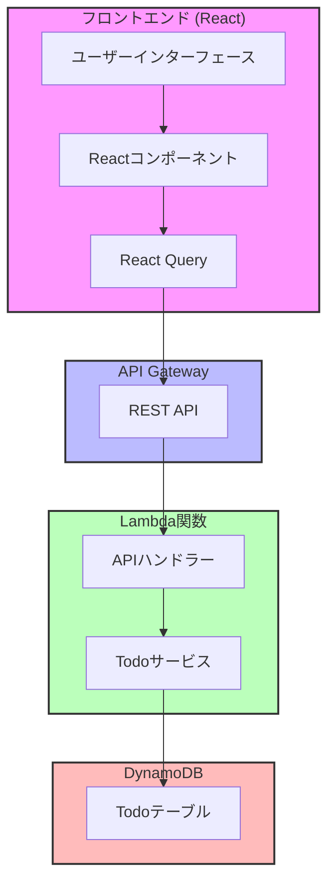
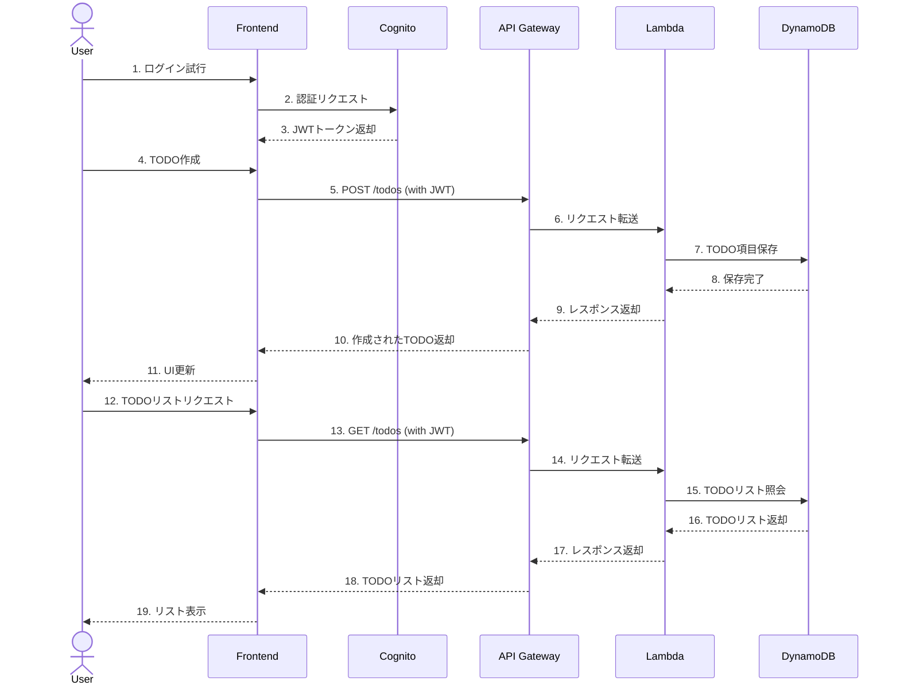
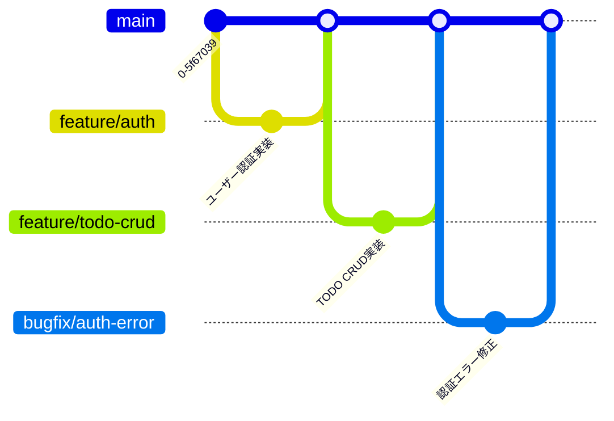

# 🚀 AWS サーバーレス TODO アプリケーション

[](https://creativecommons.org/licenses/by-sa/4.0/deed.ko)
[](https://github.com/awskrug/aiengineering-demo/stargazers)
[](https://todo.awskrug.dev)

AWS サーバーレスアーキテクチャを活用した現代的な TODO アプリケーションです。このプロジェクトは [2025年1月22日に開催された AWS Korea User Groupの AI エンジニアリングミートアップ](https://www.meetup.com/awskrug/events/305372486/?slug=awskrug&eventId=305372486)での発表内容の一部として、ライブコーディングを通じて制作されました。

🔗 [デモアプリケーション](https://awskrug.github.io/aiengineering-demo/) - 時間の関係上、フロントエンドのみデプロイしました

## 📚 プロジェクトドキュメント

- プレゼンテーション資料
  - [CDDが来る](https://bit.ly/3DRyxNA)
  - [AIを使用したインフラ自動販売機](https://bit.ly/3CY8ogd)

- [設計ドキュメント](doc/ja/design.md) - プロジェクトアーキテクチャと技術スタック
- [タスクリスト](doc/ja/todo.md) - 開発進捗状況とTODOリスト
- [デモシナリオ](doc/ja/demo_scenario.md) - AIエンジニアリングデモの進行プロセス
- [セキュリティコンプライアンス](doc/ja/compliance.md) - K-ISMS要件マッピング
- [K-ISMS AWSマッピング](doc/ja/k-isms-aws-mapping.md) - K-ISMS規制とAWS Config規則のマッピング
- [ピアレビュー](doc/ja/peer_review.md) - 開発者分析と改善提案
- [Terraformテンプレート](terraform/README.ja.md) - AWSインフラTerraformテンプレート

## ✨ 主な機能

- 📝 TODO項目の作成、照会、修正、削除
- 🔐 ユーザー認証（会員登録/ログイン）
- 📱 レスポンシブデザイン
- 🌐 サーバーレスアーキテクチャ

## 🛠️ 技術スタック

### フロントエンド
- React.js
- TypeScript
- Material-UI
- React Query
- React Router

### バックエンド
- AWS CDK
- AWS Lambda
- Amazon DynamoDB
- Amazon Cognito
- Amazon API Gateway

## 🏗 システムアーキテクチャ



### システム相互作用



## 🚀 はじめに

### 前提条件

- Node.js v18以上
- AWS CLI設定済み
- AWS CDK CLIインストール済み

### インストール方法

1. リポジトリのクローン
```bash
git clone https://github.com/awskrug/aiengineering-demo.git
cd aiengineering-demo
```

2. バックエンドのデプロイ
```bash
cd backend
npm install
npm run cdk deploy
```

3. フロントエンドの実行
```bash
cd frontend
npm install
npm start
```

## 🌳 ブランチ管理

このプロジェクトは[GitHub Flow](https://guides.github.com/introduction/flow/)ブランチ戦略に従います。

### ブランチ戦略ダイアグラム



### 主要ブランチ
- `main`: 製品の安定バージョンを管理する基本ブランチ
- `feature/*`: 新機能開発用ブランチ
- `bugfix/*`: バグ修正用ブランチ

### ブランチ命名規則
- 機能開発: `feature/login`, `feature/todo-list`
- バグ修正: `bugfix/auth-error`, `bugfix/api-timeout`

### 作業プロセス
1. 新しい作業開始
   ```bash
   git checkout main
   git pull origin main
   git checkout -b feature/new-feature
   ```

2. 作業中の定期的なコミット
   ```bash
   git add .
   git commit -m "feat: 新機能実装"
   git push origin feature/new-feature
   ```

## 📄 ライセンス

このプロジェクトは[クリエイティブ・コモンズ 表示 - 継承 4.0 国際 ライセンス](https://creativecommons.org/licenses/by-sa/4.0/deed.ja)の下で提供されています。

## 🤝 貢献

プロジェクトへの貢献に興味がある方は、以下の手順に従ってください：

1. このリポジトリをフォーク
2. 機能ブランチを作成 (`git checkout -b feature/amazing-feature`)
3. 変更をコミット (`git commit -m 'feat: 素晴らしい機能を追加'`)
4. ブランチをプッシュ (`git push origin feature/amazing-feature`)
5. プルリクエストを開く

## 👥 メンテナ

- [AWSKRUG AI Engineering](https://github.com/awskrug)

## 🙏 謝辞

- AWS Korea User Group コミュニティメンバー
- このプロジェクトに貢献してくださった全ての方々

---

*このREADMEは[韓国語](README.md)でも利用可能です。*
