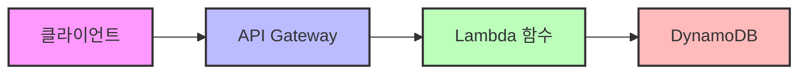
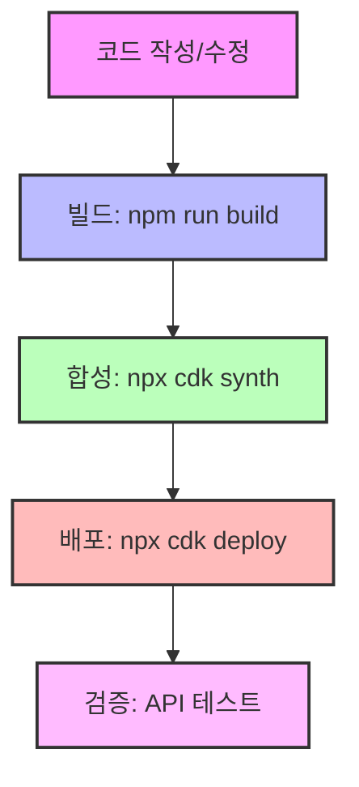
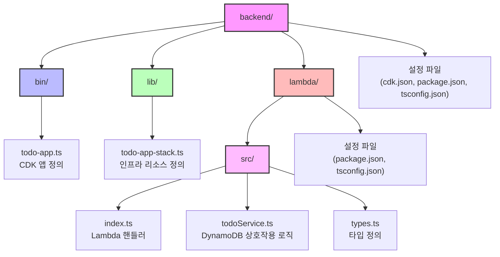

# 🏗️ TODO 애플리케이션 백엔드 및 인프라 설계 문서

## 📋 개요

이 문서는 AWS CDK를 사용하여 구현된 TODO 애플리케이션의 백엔드 및 인프라 아키텍처에 대한 설명입니다. 서버리스 아키텍처를 기반으로 확장성, 비용 효율성, 유지 관리 용이성을 고려하여 설계되었습니다.

## 🏛️ 아키텍처 개요



## 🧱 인프라 구성 요소

### 1. AWS CDK (Cloud Development Kit)
- **사용 버전**: TypeScript 기반 CDK
- **목적**: 인프라를 코드로 정의하고 관리
- **주요 기능**: CloudFormation 템플릿 자동 생성, 리소스 프로비저닝 자동화

### 2. Amazon DynamoDB
- **테이블명**: TodoTable
- **파티션 키**: id (문자열)
- **빌링 모드**: 온디맨드 (PAY_PER_REQUEST)
- **TTL 속성**: ttl (선택 사항)
- **데이터 모델**:
  ```typescript
  {
    id: string;            // 고유 식별자
    title: string;         // TODO 제목
    description?: string;  // TODO 설명 (선택사항)
    completed: boolean;    // 완료 상태
    createdAt: string;     // 생성 시간
    updatedAt: string;     // 업데이트 시간
  }
  ```

### 3. AWS Lambda
- **런타임**: Node.js 18.x
- **핸들러**: index.handler
- **환경 변수**:
  - TODO_TABLE_NAME: DynamoDB 테이블 이름
  - POWERTOOLS_SERVICE_NAME: 'todo-api'
  - LOG_LEVEL: 'INFO'
- **주요 기능**: API 요청 처리, DynamoDB와 상호작용

### 4. Amazon API Gateway
- **API 이름**: Todo Service
- **엔드포인트**:

```mermaid
classDiagram
    class TodoAPI {
        +GET /todos
        +GET /todos/{id}
        +POST /todos
        +PUT /todos/{id}
        +DELETE /todos/{id}
    }
    
    class Endpoints {
        모든 TODO 항목 조회
        특정 TODO 항목 조회
        새 TODO 항목 생성
        TODO 항목 업데이트
        TODO 항목 삭제
    }
    
    TodoAPI --> Endpoints : 기능
```

- **CORS 설정**: 모든 오리진 및 메서드 허용

## 🔄 배포 워크플로우



1. **코드 작성/수정**: CDK 코드 및 Lambda 함수 구현
2. **빌드**: `npm run build` - TypeScript 코드를 JavaScript로 컴파일
3. **합성**: `npx cdk synth` - CloudFormation 템플릿 생성
4. **배포**: `npx cdk deploy` - AWS 계정에 인프라 배포
5. **검증**: API Gateway 엔드포인트를 통한 기능 테스트

## 📦 코드 구조



## 🛠️ 개발 및 배포 가이드

### 로컬 개발 환경 설정

1. **필수 도구 설치**:
   ```bash
   npm install -g aws-cdk
   ```

2. **종속성 설치**:
   ```bash
   npm install
   ```

3. **AWS 자격 증명 설정**:
   ```bash
   aws configure
   ```

### 배포 명령어

1. **CDK 부트스트랩** (최초 1회):
   ```bash
   npx cdk bootstrap
   ```

2. **변경 사항 미리보기**:
   ```bash
   npx cdk diff
   ```

3. **배포 실행**:
   ```bash
   npx cdk deploy
   ```

4. **스택 삭제**:
   ```bash
   npx cdk destroy
   ```

## 🔍 모니터링 및 로깅

- **CloudWatch Logs**: Lambda 함수 로그 확인
- **CloudWatch Metrics**: API Gateway 및 Lambda 메트릭 모니터링
- **X-Ray**: (향후 구현 예정) 요청 추적 및 성능 분석

## 🔒 보안 고려사항

1. **IAM 권한**: Lambda 함수에 최소 권한 부여 (DynamoDB 테이블에 대한 읽기/쓰기 권한만 제공)
2. **API 인증**: (향후 구현 예정) Amazon Cognito 또는 API 키를 통한 인증
3. **데이터 보호**: HTTPS를 통한 전송 중 암호화

## 🚀 확장 계획

1. **인증 추가**: Amazon Cognito를 통한 사용자 인증 구현
2. **캐싱 레이어**: API Gateway 캐싱 추가로 성능 향상
3. **백업 및 복구**: DynamoDB 백업 자동화
4. **CI/CD 파이프라인**: GitHub Actions를 통한 자동 배포

## 📚 참고 자료

- [AWS CDK 문서](https://docs.aws.amazon.com/cdk/latest/guide/home.html)
- [AWS Lambda 모범 사례](https://docs.aws.amazon.com/lambda/latest/dg/best-practices.html)
- [DynamoDB 설계 패턴](https://docs.aws.amazon.com/amazondynamodb/latest/developerguide/best-practices.html)
- [서버리스 아키텍처 가이드](https://aws.amazon.com/serverless/)
