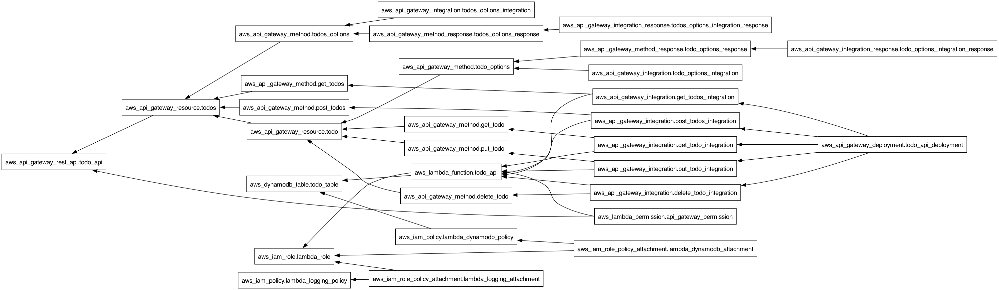

# 🏗️ TODO 애플리케이션 테라폼 템플릿

## 📋 개요

이 디렉토리는 AWS 기반의 서버리스 TODO 애플리케이션을 위한 테라폼 템플릿을 포함하고 있습니다. 이 템플릿은 AWS CDK 기반 인프라를 테라폼으로 마이그레이션한 것으로, DynamoDB, Lambda, API Gateway 리소스를 자동으로 프로비저닝합니다.

## 🧱 인프라 구성 요소

- **Amazon DynamoDB**: TODO 항목 저장을 위한 테이블
- **AWS Lambda**: API 요청 처리 및 DynamoDB 상호작용
- **Amazon API Gateway**: REST API 엔드포인트 제공
- **IAM 역할 및 정책**: 리소스 간 권한 관리

## 🛠️ 파일 구조

```
terraform/
├── main.tf           # 주요 리소스 정의
├── variables.tf      # 변수 정의
├── outputs.tf        # 출력 변수
├── package_lambda.sh # Lambda 패키징 스크립트
└── README.md         # 문서
```

## 🚀 사용 방법

### 사전 요구사항

- Terraform v1.2.0 이상
- AWS CLI 구성 (personal 프로파일)
- Node.js 18.x 이상

### 배포 단계

1. **Lambda 함수 패키징**:
   ```bash
   ./package_lambda.sh
   ```

2. **테라폼 초기화**:
   ```bash
   terraform init
   ```

3. **배포 계획 확인**:
   ```bash
   terraform plan
   ```

4. **인프라 배포**:
   ```bash
   terraform apply
   ```

5. **인프라 삭제** (필요한 경우):
   ```bash
   terraform destroy
   ```

## ⚙️ 사용자 정의 설정

`variables.tf` 파일에서 다음 변수를 조정할 수 있습니다:

- `aws_region`: AWS 리전 (기본값: ap-northeast-2)
- `environment`: 배포 환경 (dev, staging, prod)
- `dynamodb_table_name`: DynamoDB 테이블 이름
- `lambda_zip_path`: Lambda 함수 ZIP 파일 경로

## 🔍 출력 값

배포 후 다음 정보가 출력됩니다:

- API Gateway 엔드포인트 URL
- DynamoDB 테이블 이름
- Lambda 함수 이름
- API Gateway ID 및 스테이지

## 📊 리소스 의존관계

테라폼 리소스 간의 의존관계는 다음 그래프에서 확인할 수 있습니다:



의존관계 그래프는 다음과 같은 정보를 제공합니다:

- 리소스 간의 의존성 (어떤 리소스가 다른 리소스에 의존하는지)
- 리소스 생성 순서
- 리소스 그룹 및 관계

그래프는 코드 변경 시 자동으로 업데이트됩니다. SVG 형식의 그래프도 제공됩니다: [SVG 그래프](./graphs/terraform_graph.svg)

### 의존관계 그래프 수동 생성

의존관계 그래프를 수동으로 생성하려면 다음 명령을 실행하세요:

```bash
cd terraform
./generate_graph.sh
```

## 🔒 보안 고려사항

- Lambda 함수에는 최소 권한 원칙이 적용되어 있습니다
- API Gateway는 CORS 설정이 구성되어 있습니다
- 향후 인증 메커니즘 추가가 필요합니다 (Amazon Cognito 등)

## 📚 참고 자료

- [Terraform AWS 제공자 문서](https://registry.terraform.io/providers/hashicorp/aws/latest/docs)
- [AWS Lambda 모범 사례](https://docs.aws.amazon.com/lambda/latest/dg/best-practices.html)
- [DynamoDB 설계 패턴](https://docs.aws.amazon.com/amazondynamodb/latest/developerguide/best-practices.html)
